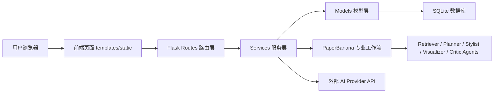
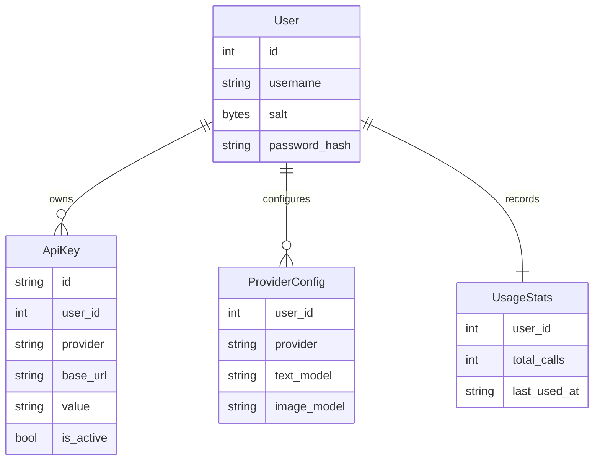
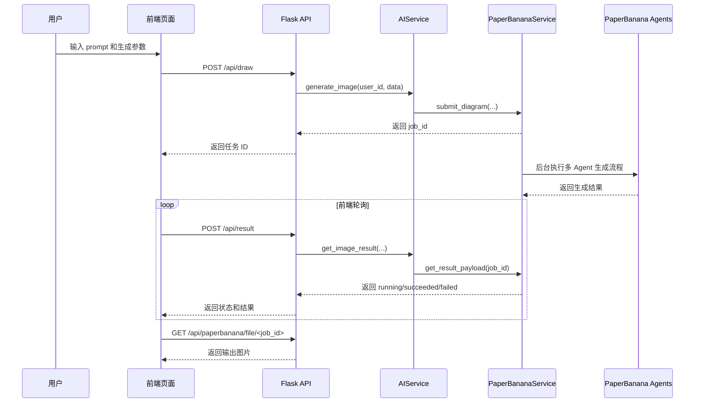
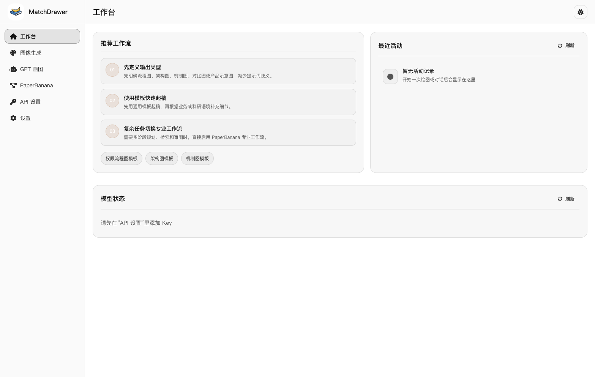
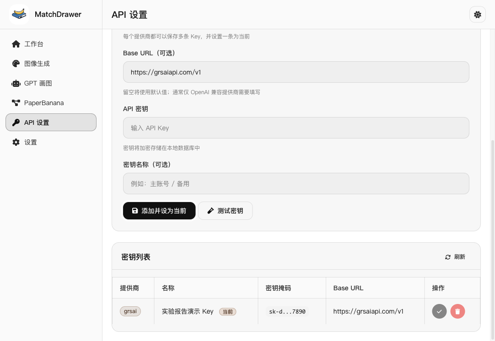
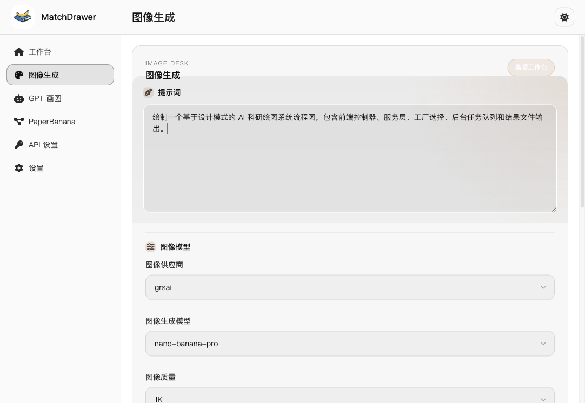
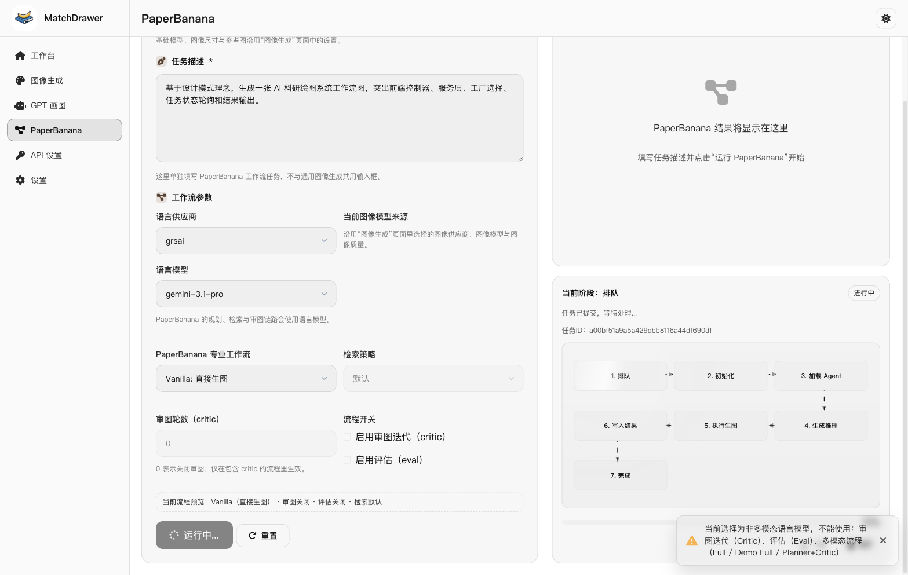
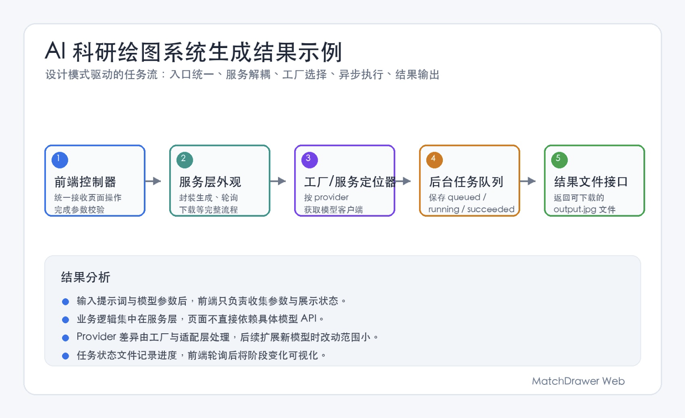

# AI 科研绘图 Web 系统综合实验报告
## 一、实验目的

本次综合实验的目的，是在自主选题的基础上完成一个具有实际功能的程序项目，并在真实代码中体现设计模式的使用。

通过本次实验，需要达到以下目标：第一，训练自主选题和需求分析能力，能够根据实际场景确定程序要解决的问题；第二，掌握一个完整软件项目的基本开发过程，包括功能划分、模块设计、数据存储、前后端交互和异常处理；第三，理解常见设计模式在真实项目中的作用，能够说明模式解决了什么具体问题；第四，能够结合代码说明系统结构，而不是只从概念层面描述设计；第五，能够通过运行截图、测试用例和结果分析验证程序功能，并对项目中存在的不足进行总结。

## 二、实验内容及要求

本次综合实验要求学生自主选择题目，独立完成一个可以运行的软件项目。项目需要有明确的应用场景和基本完整的功能流程，不能只停留在单个算法、单个页面或简单示例程序层面。实验过程中需要完成需求分析、总体设计、模块划分、代码实现、程序测试和结果分析，并在实验报告中把设计思路、主要功能、关键代码和测试结果说明清楚。

本次实验还要求在项目中体现设计模式思想。这里的“体现”不是在报告中罗列模式名称，而是要结合实际代码说明模式怎样参与程序设计。报告需要说明所采用的设计模式分别解决了哪些问题，例如对象创建、服务复用、接口适配、业务封装、请求分发、流程组织、状态传递和异常处理等。对于没有在项目中明显使用的传统模式，不应强行写入报告。

## 三、实验设备及软件

本次实验在本地笔记本环境中完成开发、调试和运行测试。实验所用软件包括操作系统、Python 运行环境、Web 后端框架、数据库、前端开发环境以及常用开发工具。具体环境如下表所示。

| 类型 | 配置 |
|---|---|
| 实验设备 | MacBook Air，Apple M5 芯片，10 核 CPU，16 GB 内存，arm64 架构 |
| 操作系统 | macOS 26.4.1，Build 25E253 |
| 后端语言与环境 | Python 3.14.4 |
| 后端框架 | Flask 3.0.3 |
| 数据库 | SQLite 3.51.0 |
| 前端技术 | HTML、CSS、JavaScript |
| 主要第三方库 | requests、cryptography、python-dotenv、Pillow、google-genai、openai 等 |
| 开发与调试工具 | Terminal、VS Code、本地浏览器 |

## 四、设计方案

### ㈠ 题目

AI 科研绘图 Web 系统设计与实现

本题目为自主选题。选题时主要考虑三个方面：

1. 项目应有实际应用价值，可以解决一个真实场景中的问题。
2. 项目应有一定综合性，不能只是一个简单函数或小型脚本。
3. 项目应可以自然体现设计模式理念，避免为了凑模式而写模式。

MatchDrawer 满足这些要求。它既是一个可以运行的 AI 绘图 Web 系统，又包含多个需要解耦的模块，比如用户认证、密钥管理、provider 配置、任务状态管理、外部服务适配和 Agent 流水线。所以，这个项目比较适合作为综合实验题目，也比较适合用来说明设计模式如何在真实工程中解决复杂性。

### ㈡ 设计的主要思路

系统采用前后端协作的 Web 架构。用户通过浏览器访问前端页面，前端将用户输入和配置发送到 Flask 后端。后端通过路由层接收请求，再调用服务层完成业务逻辑。服务层根据需要读取数据库、调用 PaperBanana 专业工作流或外部 AI provider，最后将统一格式的结果返回前端。

整体设计思想是：

1. **路由层只负责请求入口**
   路由函数不直接写复杂业务逻辑，只负责解析请求、获取当前用户、调用服务层并返回响应。

2. **服务层负责业务编排**
   认证、API Key 管理、模型配置、AI 生成、PaperBanana 任务管理都封装在不同 service 中，使业务逻辑清晰。

3. **模型层负责数据表达和持久化**
   用户、API Key、provider 配置、使用统计等都封装为模型类，模型类负责与 SQLite 数据库交互。

4. **工具层负责通用能力**
   加密、参数校验、错误类型等通用能力独立放在 `utils` 中，避免重复实现。

5. **前端负责交互和状态展示**
   前端负责用户输入、按钮事件、任务轮询、进度展示和结果展示，不直接访问数据库或外部 AI 服务。

从设计模式角度看，本项目并不是先把功能写完，再回头硬套模式。实际设计时，很多模式是在拆分模块时自然出现的：有些地方需要统一入口，有些地方需要把外部服务差异隔离开，有些地方则需要把重复的登录校验、错误处理抽出来。对应关系如下：

| 架构位置 | 使用的设计模式理念 | 解决的设计问题 |
|---|---|---|
| Flask 应用入口 | 工厂模式 | 统一创建应用对象、加载配置并注册蓝图，避免初始化逻辑分散 |
| 路由层 | MVC / 前端控制器模式 | 统一接收请求，路由只做参数解析和业务分发，不直接处理复杂业务 |
| 服务层 | 外观模式 | 用 `AIService`、`ApiKeyService` 等服务封装复杂子系统，对路由层暴露简单接口 |
| 服务获取 | 单例模式 / 服务定位器模式 | 统一复用配置、数据库、认证和 AI 服务对象，减少重复创建和状态不一致 |
| Provider 选择 | 工厂模式思想 / 策略模式思想 | 根据 provider、模型能力和协议选择不同调用路径，隔离外部服务变化 |
| API Key 与数据库访问 | DAO 思想 | 集中管理数据查询、保存、加密和掩码展示，避免 SQL 与业务逻辑混杂 |
| 登录和异常处理 | 装饰器模式 / 拦截过滤器模式 | 将登录校验、错误捕获等横切逻辑从业务函数中抽离 |
| PaperBanana 工作流 | 模板模式 / 组合模式思想 | 用统一 Agent 接口组织检索、规划、生图、审图等步骤，复杂流程由多个模块组合完成 |
| 任务状态返回 | 传输对象模式 / 适配器模式 | 用统一任务状态对象和统一 JSON payload 屏蔽后台实现细节 |

项目主要模块划分如下：

| 模块 | 主要文件或目录 | 职责说明 |
|---|---|---|
| 应用入口 | `app.py` | 创建 Flask 应用，加载配置，注册认证、API 和主页面蓝图 |
| 路由层 | `src/routes` | 定义页面路由和 API 路由，完成请求解析、登录校验和响应返回 |
| 服务层 | `src/services` | 封装认证、API Key、provider 配置、AI 调用、PaperBanana 任务等业务逻辑 |
| 模型层 | `src/models` | 定义用户、API Key、provider 配置和使用统计等数据模型 |
| 工具层 | `src/utils` | 提供参数校验、错误类型、密钥加密等通用能力 |
| 前端页面 | `templates`、`static` | 提供页面结构、样式、事件绑定、API 调用和任务轮询 |
| PaperBanana 集成 | `integrations/PaperBanana` | 提供科研图表生成多 Agent 工作流 |
| GPT Image Playground 子项目 | `GPT_Image_Playground-main` | 提供更复杂的图像生成前端工作台和 Zustand 状态管理 |

系统总体结构如下：



### 数据设计

系统主要数据对象如下：

| 数据对象 | 对应模型 | 关键字段 | 作用 |
|---|---|---|---|
| 用户信息 | `User` | `id`、`username`、`salt`、`password_hash` | 保存登录用户和密码哈希 |
| API 密钥 | `ApiKey` | `id`、`user_id`、`provider`、`base_url`、`value`、`is_active` | 保存不同 provider 的 API Key 和激活状态 |
| 模型配置 | `ProviderConfig` | `user_id`、`provider`、`text_model`、`image_model` | 保存每个 provider 默认文本模型和图像模型 |
| 使用统计 | `UsageStats` | `user_id`、`total_calls`、`last_used_at` | 记录用户调用次数和最后使用时间 |
| 后台任务状态 | `PaperBananaJob` | `job_id`、`status`、`progress`、`stage`、`error` | 在图像生成过程中传递任务状态 |

数据关系如下：



### 主要业务流程

图像生成是系统中最重要的一条业务流程。由于生成过程可能持续较长时间，所以这里没有让浏览器一直同步等待，而是采用“提交任务 + 后台执行 + 前端轮询 + 结果下载”的形式。



### ㈢ 主要功能

1. **用户认证功能**
   系统提供默认用户初始化、登录、退出和登录状态维护。认证逻辑封装在 `AuthService` 中，路由层通过装饰器进行登录校验。

2. **API Key 管理功能**
   用户可以为不同 provider 添加 API Key、base URL 和名称。密钥经过加密后保存到 SQLite，前端展示时只显示掩码，避免明文泄露。

3. **Provider 模型配置功能**
   系统支持为不同 provider 保存默认文本模型和图像模型，比如 `grsai`、`openai`、`deepseek`、`openrouter`、`anthropic`、`google` 等。

4. **AI 图像生成入口**
   前端通过 `/api/draw` 提交图像生成请求，后端完成参数校验、模型选择和任务提交。

5. **PaperBanana 专业工作流**
   PaperBanana 使用多个 Agent 完成科研图表生成，包括 RetrieverAgent、PlannerAgent、StylistAgent、VisualizerAgent、CriticAgent 和 PolishAgent 等。

6. **任务状态管理功能**
   后台任务会记录 `queued`、`initializing`、`loading_agents`、`processing`、`saving`、`completed`、`failed` 等阶段，前端可以实时查看任务进度。

7. **结果展示与下载功能**
   任务成功后，系统将生成图片保存为文件，并通过 `/api/paperbanana/file/<job_id>` 返回给前端展示或下载。

8. **异常处理功能**
   系统能处理未登录、缺少 API Key、prompt 为空、任务 ID 无效、生成失败等异常情况，并返回明确错误信息。

功能完成情况如下：

| 设计目标 | 对应功能 | 实现方式 | 完成情况 |
|---|---|---|---|
| Web 系统可访问 | 首页、登录页、主页面 | Flask 模板渲染和静态资源加载 | 已完成 |
| 用户身份管理 | 登录、退出、默认用户 | `AuthService` + session | 已完成 |
| API Key 安全保存 | 添加、删除、激活、掩码展示 | `ApiKeyService` + `EncryptionService` | 已完成 |
| provider 模型配置 | 文本模型、图像模型默认值 | `ProviderConfigService` | 已完成 |
| 图像任务提交 | `/api/draw` | `AIService.generate_image()` | 已完成 |
| 后台异步执行 | 后台线程和状态文件 | `PaperBananaService` | 已完成 |
| 任务轮询查询 | `/api/result` | 统一状态 payload | 已完成 |
| 结果文件返回 | `/api/paperbanana/file/<job_id>` | `send_file` 返回图片 | 已完成 |
| 设计模式应用 | 多个模块体现不同模式 | 单例、装饰器、外观、适配器、模板等 | 已完成 |

## 五、代码实现分析

这次综合实验要求项目中体现设计模式理念。我的理解是，设计模式不是写完项目后再在报告里补几个名称，而是在设计和实现过程中真正帮助我们解决问题。比如：

1. 服务对象需要统一创建和复用，所以使用单例模式和服务定位器模式。
2. 多个路由都需要登录校验和异常处理，所以使用装饰器模式和拦截过滤器模式。
3. 路由层不应该了解所有 AI provider 和 PaperBanana 内部细节，所以用 `AIService` 作为外观接口。
4. 不同外部服务返回格式不同，所以需要适配成统一前端 payload。
5. 多个 Agent 都需要统一处理入口，所以使用抽象基类和模板模式思想。

### 1. 设计模式应用总览

| 设计模式 | 项目体现 | 解决的问题 | 如何做到 |
|---|---|---|---|
| 工厂模式 | `create_app()` 创建 Flask 应用 | 集中管理应用初始化过程 | 将配置加载、Flask 实例创建、Blueprint 注册和默认用户初始化放在一个应用工厂函数中 |
| MVC 模式 | `models`、`routes`、`templates/static` 分层 | 分离数据、控制逻辑和界面展示 | 模型负责数据，路由负责请求控制，模板和静态文件负责页面 |
| 单例模式 | `get_config()`、`get_ai_service()`、`get_db_manager()` 等 | 避免重复创建全局服务对象 | 使用模块级变量保存实例，第一次调用时创建，后续直接返回 |
| 服务定位器模式 | `get_xxx_service()` | 简化服务对象获取方式 | 路由和服务不直接 new 对象，而是通过统一函数获取服务 |
| 装饰器模式 | `@api_login_required`、`@handle_api_errors` | 给路由函数增强登录校验和异常处理 | 使用 Python 装饰器包装原函数，在执行前后添加逻辑 |
| 拦截过滤器模式 | 登录校验和 API 错误处理 | 统一处理横切逻辑 | 请求进入业务函数前先经过装饰器检查 |
| 外观模式 | `AIService` | 屏蔽 AI 调用和任务编排复杂度 | 路由层只调用 `generate_image()`、`get_image_result()` 等统一方法 |
| 适配器模式 | PaperBanana / Anthropic 等结果转统一结构 | 屏蔽不同接口返回格式差异 | 后端将不同来源结果转换成前端可消费的统一 JSON |
| 模板模式 | `BaseAgent.process()` | 统一 Agent 处理接口 | 父类定义抽象方法，子类分别实现检索、规划、审查等逻辑 |
| 组合模式思想 | `PaperVizProcessor` 组合多个 Agent | 将复杂生成流程拆成多个步骤 | Processor 按模式组合 Retriever、Planner、Stylist、Visualizer、Critic |
| 策略模式思想 | 根据 provider / protocol 选择调用路径 | 支持多 provider 和多协议 | 服务层根据 provider、模型能力和协议选择不同分支 |
| 数据访问对象模式思想 | `DatabaseManager` | 集中管理数据库连接和查询 | 封装 `execute_query`、`fetch_one`、`fetch_all` 等方法 |
| 传输对象模式 | `PaperBananaJob` 和 JSON payload | 在模块之间传递结构化状态 | 用 dataclass 和字典统一传递任务状态与结果 |
| 前端控制器模式 | Flask Blueprint 和路由函数 | 集中接收并分发前端请求 | 所有浏览器请求先进入 Flask 路由，再调用相应服务 |

### 2. 应用工厂模式

项目在 `app.py` 中定义 `create_app()` 方法，用于创建 Flask 应用、设置配置项、注册 Blueprint 和初始化默认用户。

```python
def create_app() -> Flask:
    config = get_config()
    app = Flask(__name__)
    app.secret_key = config.app_secret_key
    app.register_blueprint(auth_bp)
    app.register_blueprint(api_bp)
    app.register_blueprint(main_bp)
    User.ensure_default_user()
    return app
```

这个设计体现了工厂模式思想。外部调用者只需要调用 `create_app()`，不需要关心 Flask 对象如何创建、配置如何加载、路由如何注册。这样做的好处是应用初始化逻辑集中，后续测试或部署时也更容易复用。

### 3. MVC 模式

项目整体采用 MVC 思想组织代码：

| MVC 角色 | 项目对应部分 | 说明 |
|---|---|---|
| Model | `src/models` | 定义 `User`、`ApiKey`、`ProviderConfig`、`UsageStats` 等数据模型 |
| View | `templates`、`static` | 负责页面结构、样式和前端交互 |
| Controller | `src/routes` | 接收 HTTP 请求，调用服务层并返回 JSON 或页面 |

比如 `/api/draw` 路由并不直接执行复杂图像生成逻辑，而是调用 `AIService.generate_image()`。这说明 Controller 只负责请求控制，真正业务逻辑由 service 完成。这种分层让代码更清晰，也方便后续维护。

### 4. 单例模式与服务定位器模式

项目中很多服务采用模块级懒加载单例，比如 `AIService`：

```python
_ai_service: Optional[AIService] = None

def get_ai_service() -> AIService:
    global _ai_service
    if _ai_service is None:
        _ai_service = AIService()
    return _ai_service
```

类似方法还包括：

1. `get_config()`
2. `get_db_manager()`
3. `get_auth_service()`
4. `get_api_key_service()`
5. `get_provider_config_service()`
6. `get_paper_banana_service()`
7. `get_validation_service()`

这些方法体现了两个设计模式：

1. **单例模式**
   保证服务对象不会在项目中被反复创建，避免重复初始化数据库、配置和服务依赖。

2. **服务定位器模式**
   调用方通过 `get_xxx_service()` 获取服务，而不需要知道服务对象如何创建、依赖什么参数。

这种设计尤其比较适合当前 Flask 项目，因为路由函数分散在多个文件中，如果每个路由都自己创建服务对象，会造成重复代码和状态不一致。

### 5. 装饰器模式与拦截过滤器模式

项目在 `src/routes/decorators.py` 中定义了登录校验和错误处理装饰器：

```python
@api_bp.post("/draw")
@api_login_required
@handle_api_errors
def draw() -> Any:
    ...
```

其中：

1. `api_login_required` 用于判断 API 请求是否已登录。
2. `login_required` 用于页面请求登录校验。
3. `handle_api_errors` 用于统一捕获 API 错误并返回 JSON。

这体现了装饰器模式：在不修改原路由函数内部逻辑的情况下，为函数增加额外能力。它也体现了拦截过滤器模式：请求真正进入业务逻辑之前，先经过登录校验和异常处理。

这样做的优点是：

1. 避免每个路由重复写登录判断。
2. 避免每个路由重复写 try-except。
3. 让路由函数更专注于自己的业务。
4. 统一 API 错误返回格式，便于前端处理。

### 6. 外观模式

`AIService` 是后端 AI 相关业务的统一入口。路由层只需要调用：

1. `generate_image()`
2. `get_image_result()`
3. `cancel_image_result()`
4. `chat_completion()`

路由层不需要知道底层是调用 grsai、OpenAI-compatible provider、Anthropic，还是调用 PaperBanana 本地工作流。

```text
Routes -> AIService -> ApiKeyService / ProviderConfigService / PaperBananaService / UsageStats
```

这体现了外观模式。`AIService` 为复杂子系统提供了一个统一接口，降低了路由层的复杂度。后续如果底层 provider 调用方式改变，只需要修改 service 内部，路由层基本不用变化。

### 7. 适配器模式

项目中存在多个外部接口和内部工作流，它们返回的数据格式并不相同。比如：

1. Anthropic 的消息接口和 OpenAI Chat Completions 格式不同。
2. PaperBanana 本地生成的是任务状态、base64 图片和本地文件路径。
3. 前端希望读取统一的 JSON 字段来展示结果。

所以，后端需要把不同来源的数据转换成统一结构。比如 PaperBanana 成功后返回：

```json
{
  "id": "job_id",
  "status": "succeeded",
  "progress": 100,
  "stage": "completed",
  "model": "paperbanana",
  "results": [
    {
      "url": "/api/paperbanana/file/job_id",
      "content": "PaperBanana generated"
    }
  ]
}
```

这就是适配器模式的作用：**让前端面对统一接口，而不是直接面对每一种外部服务的差异**。如果没有适配器思想，前端就需要为每个 provider 写不同展示逻辑，系统会变得难以维护。

### 8. 模板模式

PaperBanana 子模块中定义了 `BaseAgent` 抽象类：

```python
class BaseAgent(ABC):
    @abstractmethod
    async def process(self, data: Dict[str, Any], **kwargs) -> Dict[str, Any]:
        pass
```

不同 Agent 都继承 `BaseAgent`，并实现自己的 `process()` 方法，比如：

1. `RetrieverAgent` 负责检索参考样例。
2. `PlannerAgent` 负责生成图像描述规划。
3. `StylistAgent` 负责风格化。
4. `VisualizerAgent` 负责生成图像。
5. `CriticAgent` 负责审查和改进建议。
6. `PolishAgent` 负责进一步润色。

这体现了模板模式和多态思想：父类规定统一处理接口，子类实现不同处理步骤。这样 `PaperVizProcessor` 可以统一调用各个 Agent 的 `process()`，而不需要关心每个 Agent 内部如何实现。

### 9. 组合模式思想

PaperBanana 的完整生成过程不是由单个对象完成，而是由多个 Agent 组合完成。`PaperVizProcessor` 负责将这些 Agent 按不同实验模式组合起来：

```text
RetrieverAgent -> PlannerAgent -> StylistAgent -> VisualizerAgent -> CriticAgent -> Evaluation
```

这种设计体现了组合模式思想。每个 Agent 是一个相对独立的功能模块，复杂任务通过组合多个模块完成。这样做的优点是：

1. 每个 Agent 职责清晰。
2. 工作流可以按模式灵活组合。
3. 某个 Agent 的实现变化不会直接影响其他 Agent。
4. 后续可以增加新的 Agent 或新的工作流模式。

### 10. 策略模式思想

系统支持多个 provider 和多种调用协议。不同 provider 的调用方式、headers、base URL 和返回格式可能不同，因此服务层需要根据 provider 和模型选择不同处理路径。

比如：

1. `anthropic` 使用 Anthropic Messages API。
2. OpenAI-compatible provider 使用 `/chat/completions`。
3. PaperBanana 图像生成走本地多 Agent 工作流。
4. GPT Image Playground 子项目可以根据 `apiProtocol` 在 `images`、`responses`、`auto` 之间选择。

当前项目主要通过条件分支来完成这类选择，还没有完全拆成独立策略类。不过从思路上看，它已经接近策略模式：不同 provider 或协议对应不同调用路径，服务层根据参数选择其中一种。后续如果 provider 继续增加，可以再把这些分支拆成更标准的策略类。

### 11. 数据访问对象模式思想

项目使用 `DatabaseManager` 统一管理数据库连接和查询：

```python
class DatabaseManager:
    def execute_query(...)
    def execute_insert(...)
    def fetch_one(...)
    def fetch_all(...)
```

模型类中也封装了保存和查询方法，比如 `User.get_by_username()`、`ApiKey.get_by_user_id()`、`ProviderConfig.get_by_user_provider()` 等。

这种设计有 DAO 和 Active Record 的混合特点：

1. `DatabaseManager` 提供统一数据库访问能力。
2. 模型类负责把数据库记录转换为业务对象。
3. 路由层和前端不直接接触 SQL。

这样能减少数据库操作散落在各处的问题，使数据访问逻辑更加集中。

### 12. 传输对象模式

后台任务状态通过 `PaperBananaJob` dataclass 表达：

```python
@dataclass(frozen=True)
class PaperBananaJob:
    job_id: str
    status: str
    progress: int
    stage: str = "queued"
    stage_message: Optional[str] = None
    output_image_path: Optional[str] = None
    error: Optional[str] = None
```

这个对象用于在后台任务执行、状态文件保存、结果读取和 API 返回之间传递状态数据。它体现了传输对象模式：将多个相关字段封装为一个结构化对象，便于不同层之间传递。

如果没有这种结构，任务状态可能会散落成多个无约束的变量，容易造成字段遗漏或格式不一致。

### 13. 前端控制器模式

Flask Blueprint 和路由函数承担前端控制器角色。浏览器请求不会直接访问服务类或数据库，而是先进入路由层，再由路由层分发到不同服务：

```text
/api/keys -> ApiKeyService
/api/provider-configs -> ProviderConfigService
/api/draw -> AIService
/api/result -> AIService
/api/paperbanana/file/<job_id> -> PaperBananaService
```

这种结构契合前端控制器模式思想：前端请求集中进入后端控制器，由控制器统一进行认证、参数解析和业务分发。它让系统请求入口更加清晰，也便于统一加权限校验和错误处理。

### 14. 主要业务流程实现分析

图像生成流程是这个项目里最重要的业务之一。这个流程采用异步任务式设计，大体步骤如下：

1. **前端收集参数**
   用户输入 prompt，选择 provider、文本模型、图像模型、图片比例、图片尺寸和工作流模式。

2. **提交生成请求**
   前端调用 `/api/draw`，后端路由进入 `AIService.generate_image()`。

3. **服务层校验和补全参数**
   `AIService` 对 provider、model、prompt、工作流参数进行校验，并读取用户保存的默认模型配置。

4. **创建后台任务**
   `PaperBananaService.submit_diagram()` 创建 job id，写入初始状态，并启动后台线程。

5. **执行 PaperBanana 工作流**
   后台线程按实验模式调用不同 Agent，逐步生成图像描述、风格化描述、图片结果和评估结果。

6. **保存结果和状态**
   成功后将图片保存为 `output.jpg`，并将任务状态更新为 `succeeded`；失败时写入 `failed` 和错误信息。

7. **前端轮询结果**
   前端定时调用 `/api/result`，根据状态更新页面进度。如果任务成功，则读取 `results` 中的图片 URL 展示结果。

这个流程体现了多个设计模式的协作：路由层体现前端控制器模式，`AIService` 体现外观模式，`PaperBananaJob` 体现传输对象模式，多 Agent 处理体现模板和组合思想，状态查询结果体现适配器模式。

### 15. 关键代码具体实现

为了体现“设计模式理念不是停留在文字说明中，而是落实到具体代码结构中”，本节从前端提交、后端路由、服务层调度、后台任务、结果返回和密钥管理六个角度分析项目的关键实现。

#### 15.1 前端参数收集与控制器调用

前端主要入口位于 `static/js/app.js` 中的 `generateImage(mode = 'generic')` 函数。这个函数可以看作页面层的控制器，负责读取用户输入，判断当前是普通图像生成模式还是 PaperBanana 专业工作流模式，然后把页面控件中的参数整理成统一的请求对象。

关键实现如下：

```javascript
const prompt = context.promptInput.value;
const textProvider = isPaperMode && DOM.generationTextProviderSelect
    ? DOM.generationTextProviderSelect.value
    : '';
const imageProvider = isPaperMode
    ? (DOM.paperImageProviderSelect ? DOM.paperImageProviderSelect.value : 'grsai')
    : (DOM.generationImageProviderSelect ? DOM.generationImageProviderSelect.value : 'grsai');
const imageModel = isPaperMode
    ? (DOM.paperImageModelSelect ? DOM.paperImageModelSelect.value : 'nano-banana-pro')
    : (DOM.generationImageModelSelect ? DOM.generationImageModelSelect.value : 'nano-banana-pro');
```

这段代码的作用是把页面中分散的输入控件转换为统一业务参数。普通生成模式和 PaperBanana 模式在页面控件上不同，但提交给后端时仍然整理成 `provider`、`textProvider`、`imageProvider`、`textModel`、`imageModel`、`imageSize`、`expMode` 等字段。这体现了前端控制器模式和适配器思想：页面可以不同，但提交协议保持一致。

当前端提交任务后，并不是直接等待后端长时间阻塞返回，而是调用 `window.APIService.generateImage()`，同时传入 `onProgress` 和 `onComplete` 回调：

```javascript
const result = await window.APIService.generateImage(prompt, {
    provider,
    textProvider,
    imageProvider,
    textModel,
    imageModel,
    expMode: workflowExpMode,
    retrievalSetting: workflowRetrieval,
    imageSize,
    cancellation: generationController,
    onProgress: (progress, message, payload) => {
        updatePaperTaskId(payload.id);
        updatePaperStage(payload?.stage, payload?.stageMessage || message, payload?.status || 'running');
    },
    onComplete: (resultData) => {
        handleImageGenerationComplete(resultData, context.mode);
    }
});
```

这里的 `onProgress` 会把后台任务状态同步到界面，比如任务 ID、进度条、阶段名称和工作流图节点；`onComplete` 则在任务成功后渲染结果图片。这样写以后，提交任务和展示状态分开处理，代码读起来会清楚一些。

#### 15.2 前端 APIService 的提交与轮询实现

`static/js/api-service.js` 中的 `APIService` 对后端接口进行了封装，它是前端访问后端的统一外观。前端页面不直接 `fetch('/api/draw')`，而是通过 `APIService.generateImage()` 间接调用。

提交任务时，`generateImageStream()` 将参数组装为 JSON，并请求 `/api/draw`：

```javascript
const body = {
    model,
    provider,
    textProvider,
    imageProvider,
    textModel,
    imageModel,
    expMode,
    retrievalSetting,
    criticEnabled,
    evalEnabled,
    maxCriticRounds,
    prompt,
    aspectRatio,
    imageSize,
    urls
};
body.webHook = '-1';
const response = await this.makeRequest('/api/draw', 'POST', body);
```

后端返回任务 ID 后，`generateImage()` 进入轮询流程。它每 5 秒调用一次 `/api/result`，最多轮询 240 次，即最多等待约 20 分钟：

```javascript
const maxAttempts = 240;
const pollInterval = 5000;

while (attempts < maxAttempts) {
    await new Promise(resolve => setTimeout(resolve, pollInterval));
    attempts++;
    const pollResult = await this.getImageResult(taskId);
    result = pollResult.data;

    if (onProgress) {
        const progressValue = result.progress || Math.min(10 + attempts * 2, 90);
        onProgress(progressValue, result.stageMessage, result);
    }

    if (result.status === 'succeeded') {
        if (onComplete) onComplete(result);
        return { success: true, taskId, result };
    }
}
```

这段实现用到了异步任务设计。图像生成是耗时操作，如果使用同步请求，浏览器可能会长时间等待，甚至出现超时。采用“提交任务 ID + 轮询状态”的方式后，前端可以持续看到任务进度；如果任务失败或超时，也能及时显示原因。

#### 15.3 后端路由层的前端控制器实现

后端接口集中在 `src/routes/api_routes.py`。比如图像生成和结果查询接口如下：

```python
@api_bp.post("/draw")
@api_login_required
@handle_api_errors
def draw() -> Any:
    auth_service = get_auth_service()
    ai_service = get_ai_service()

    user_id = auth_service.get_current_user_id()
    data = request.get_json(force=True, silent=True) or {}

    result = ai_service.generate_image(user_id, data)
    return jsonify(result)

@api_bp.post("/result")
@api_login_required
@handle_api_errors
def result() -> Any:
    auth_service = get_auth_service()
    ai_service = get_ai_service()
    user_id = auth_service.get_current_user_id()
    draw_id = (request.get_json(force=True, silent=True) or {}).get("id", "").strip()

    result = ai_service.get_image_result(user_id, draw_id)
    return jsonify(result)
```

路由层没有直接操作数据库，也没有直接调用外部模型，而是只做三件事：获取当前用户、读取请求参数、调用服务层。这是 MVC 中 Controller 的典型职责。`@api_login_required` 和 `@handle_api_errors` 负责在业务执行前后统一处理认证与错误，因此路由函数本身保持简洁。

#### 15.4 AIService 的外观封装与工厂选择

`src/services/ai_service.py` 中的 `AIService.generate_image()` 是后端图像生成的统一入口。它先解析前端传入的 provider、模型、工作流参数，再根据用户配置补全默认模型。

关键实现如下：

```python
provider = (data.get("provider") or "grsai").strip() or "grsai"
text_provider = (data.get("textProvider") or data.get("text_provider") or provider).strip() or provider
image_provider = (data.get("imageProvider") or data.get("image_provider") or provider).strip() or provider

text_provider = self.api_key_service.normalize_provider(text_provider)
image_provider = self.api_key_service.normalize_provider(image_provider)
provider = image_provider or text_provider or self.api_key_service.normalize_provider(provider)
```

这部分体现了工厂模式思想：系统不是把 provider 写死，而是先标准化 provider，再根据 provider 找到对应的 Key、Base URL 和模型配置。之后 `AIService` 读取用户保存的 provider 默认配置：

```python
svc = get_provider_config_service()
text_defaults = svc.get_defaults(int(user_id) if user_id else 1, text_provider)
image_defaults = svc.get_defaults(int(user_id) if user_id else 1, image_provider)

text_model = text_model or text_defaults.get("textModel") or ""
image_model = image_model or image_defaults.get("imageModel") or ""
```

如果前端没有指定模型，后端会使用默认配置或 preset 映射补全模型名。这样做的好处是前端可以保持简单，后端负责兜底和兼容旧参数。

最后，`AIService` 并不直接执行 PaperBanana 工作流，而是调用 `PaperBananaService.submit_diagram()`：

```python
service = get_paper_banana_service()
job_id = service.submit_diagram(
    user_id=user_id,
    provider=provider,
    text_provider=text_provider,
    image_provider=image_provider,
    text_model=text_model,
    image_model=image_model,
    method_content=prompt,
    caption=caption,
    image_size=image_size,
    exp_mode=exp_mode,
    retrieval_setting=retrieval_setting,
    critic_enabled=critic_enabled,
    eval_enabled=eval_enabled,
)

return {"code": 0, "data": {"id": job_id}}
```

从调用关系看，`AIService` 对路由层提供的是一个简单的“生成图片”接口，但内部实际完成了 provider 选择、模型补全、参数校验、任务创建和使用统计记录。这正是外观模式在项目中的具体体现。

#### 15.5 PaperBananaService 的后台任务实现

`src/services/paper_banana_service.py` 是这个项目最能体现异步任务和传输对象模式的部分。系统使用 `PaperBananaJob` 统一描述任务状态：

```python
@dataclass(frozen=True)
class PaperBananaJob:
    job_id: str
    status: str
    progress: int
    stage: str = "queued"
    stage_message: Optional[str] = None
    output_image_path: Optional[str] = None
    error: Optional[str] = None
```

任务状态不是用多个零散变量表达，而是封装成一个结构化对象，在“写入状态文件、读取状态文件、生成 API payload”之间传递。`_write_status()` 会把它落盘为 `status.json`：

```python
payload = {
    "jobId": job.job_id,
    "status": job.status,
    "progress": job.progress,
    "stage": job.stage,
    "stageMessage": job.stage_message,
    "outputImagePath": job.output_image_path,
    "error": job.error,
}
self._status_file(job.job_id).write_text(
    json.dumps(payload, ensure_ascii=False, indent=2),
    encoding="utf-8",
)
```

提交任务时，`submit_diagram()` 先生成 `uuid`，写入 queued 状态，再启动后台线程：

```python
job_id = uuid.uuid4().hex
self._write_status(
    PaperBananaJob(
        job_id=job_id,
        status="running",
        progress=1,
        stage="queued",
    )
)

thread = threading.Thread(
    target=self._run_job_safe,
    args=(job_id, user_id, provider, text_provider, image_provider, text_model, image_model, ...),
    daemon=True,
)
thread.start()
return job_id
```

这里的关键点是：HTTP 请求只负责创建任务并立即返回任务 ID，真正耗时的生成过程放入后台线程执行。这样前端不会被长任务阻塞。

后台线程由 `_run_job_safe()` 包裹，它捕获所有异常，并把失败信息写入任务状态：

```python
try:
    self._run_job(...)
except Exception as exc:
    self._write_status(
        PaperBananaJob(
            job_id=job_id,
            status="failed",
            progress=100,
            stage="failed",
            error=str(exc),
        )
    )
```

这使得后台任务即使失败，也不会让前端一直停留在“运行中”。前端轮询 `/api/result` 时可以拿到 `failed` 状态和错误原因，用户可以看到明确反馈。

任务成功后，服务层会把 base64 图片解码为本地文件，并将任务状态更新为 succeeded：

```python
img_bytes = base64.b64decode(b64_jpg)
out_path = job_dir / "output.jpg"
out_path.write_bytes(img_bytes)

self._write_status(
    PaperBananaJob(
        job_id=job_id,
        status="succeeded",
        progress=100,
        stage="completed",
        output_image_path=str(out_path),
    )
)
```

这部分实现体现了完整的任务生命周期：创建任务、运行任务、记录进度、保存结果、返回成功状态。

#### 15.6 结果查询与统一返回格式

前端轮询调用的 `/api/result` 最终会进入 `PaperBananaService.get_result_payload()`。该方法把内部任务状态转换为前端可理解的统一 JSON：

```python
if job.status == "succeeded":
    return {
        "id": job_id,
        "status": "succeeded",
        "progress": 100,
        "stage": job.stage or "completed",
        "stageMessage": job.stage_message or "图像生成完成",
        "model": "paperbanana",
        "results": [
            {
                "url": f"/api/paperbanana/file/{job_id}",
                "content": "PaperBanana generated",
            }
        ],
    }
```

这里体现了适配器模式：PaperBanana 内部保存的是 `status.json` 和 `output.jpg`，但前端并不需要知道这些内部文件路径，只需要读取统一的 `status`、`progress`、`stageMessage` 和 `results` 字段。

图片文件返回由 `src/routes/api_routes.py` 中的文件接口完成：

```python
@api_bp.get("/paperbanana/file/<job_id>")
@api_login_required
@handle_api_errors
def paperbanana_file(job_id: str):
    service = get_paper_banana_service()
    output_path = service.get_output_file(job_id)
    return send_file(str(output_path), mimetype="image/jpeg", conditional=True, max_age=0)
```

该接口把后端生成的本地文件转换为浏览器可访问的图片响应，前端结果展示只需要使用 `results[0].url` 即可。

#### 15.7 API Key 加密存储与掩码展示

API Key 管理位于 `src/services/api_key_service.py` 和 `src/utils/encryption.py`。添加 Key 时，系统会先清洗用户输入，防止用户把 `Bearer ` 前缀、中文备注或非 ASCII 字符误填入密钥：

```python
value = self._sanitize_api_key_value(value)
if not value:
    raise ValidationError("Api key 不能为空")
```

随后创建新的 key 记录，并把该 provider 的 active key 指向新记录：

```python
new_item = {
    "id": uuid.uuid4().hex,
    "provider": provider,
    "name": (name or "").strip(),
    "base_url": base_url,
    "value": value,
    "source": "custom",
}
keys.append(new_item)
active_by_provider[provider] = new_item["id"]
self.save_key_store(keys, active_by_provider, user_id)
```

真正保存数据库时，密钥不会明文入库，而是调用 `EncryptionService.encrypt()`：

```python
key = ApiKey(
    id=item.get("id"),
    user_id=user_id,
    provider=provider,
    name=item.get("name") or "",
    base_url=item.get("base_url") or "",
    value=self.encryption.encrypt(item.get("value", "")),
    source=item.get("source", "custom"),
    is_active=(item.get("id") == active_by_provider.get(provider)),
)
key.save()
```

前端展示密钥列表时，后端不会返回明文，而是通过 `mask_key()` 生成掩码：

```python
@staticmethod
def mask_key(value: str) -> str:
    if len(value) <= 8:
        return f"***{value[-2:]}"
    return f"{value[:4]}...{value[-4:]}"
```

所以实验截图中显示的是 `sk-d...7890` 这种形式，而不是完整密钥。这样处理后，功能可以正常使用，敏感信息也不会直接暴露在页面上。

#### 15.8 代码实现与设计模式对应关系

综合上面的代码，可以看到设计模式和具体实现之间的关系如下：

| 具体代码位置 | 实现内容 | 对应设计模式或思想 |
|---|---|---|
| `static/js/app.js` | 收集页面参数、触发生成、更新 UI 状态 | 前端控制器、回调解耦思想 |
| `static/js/api-service.js` | 封装 `/api/draw`、`/api/result`、轮询任务 | 外观模式、适配器思想 |
| `src/routes/api_routes.py` | 统一接收 HTTP 请求并分发到服务层 | 前端控制器模式、MVC |
| `src/routes/decorators.py` | 登录校验和异常处理装饰器 | 装饰器模式、拦截过滤器模式 |
| `src/services/ai_service.py` | 统一封装 provider、模型、任务创建逻辑 | 外观模式、工厂模式思想 |
| `src/services/paper_banana_service.py` | 后台任务、状态文件、结果 payload | 传输对象模式、适配器模式 |
| `src/services/api_key_service.py` | Key 清洗、加密保存、active key 管理 | DAO 思想、服务定位器思想 |
| `src/utils/encryption.py` | Fernet 加密、解密和掩码显示 | 单例模式、安全封装 |

由此可见，项目的设计模式并不是单独写几个示例类，而是贯穿在真实业务流程中：前端通过控制器收集参数，后端通过路由分发请求，服务层封装复杂业务，后台任务通过传输对象记录状态，结果接口通过适配器统一返回格式，密钥服务则通过加密和 DAO 思想保证数据安全。

### 16. 运行截图与结果说明

以下截图均来自本地运行环境。为避免泄露个人真实凭据，API Key 截图使用实验演示 Key；结果截图使用本地测试任务输出，重点验证“任务提交、状态记录、结果文件返回、前端展示”这一完整链路。

系统启动后可以正常进入主页面，页面提供图像生成、API 密钥管理、模型配置和专业工作流等入口，说明后端页面渲染和前端静态资源加载正常。



在 API 密钥管理页面中，用户可以选择 provider，填写 base URL 和 API Key。密钥保存后不会在前端明文展示，而是通过掩码方式显示，体现了系统对敏感信息的保护。



在图像生成页面中，用户可以输入 prompt，并选择 provider、文本模型、图像模型、图片比例和图片尺寸等参数。前端会将这些参数统一提交给 `/api/draw` 接口。



任务提交后，系统返回任务 ID，前端通过轮询 `/api/result` 查询任务状态。运行过程中可以看到任务 ID、进行中标签以及 queued、initializing、loading_agents、processing、saving 等阶段节点，说明后台任务状态管理正常。截图中同时出现模型能力提示，说明当前工作流配置与模型能力不匹配时，系统可以给出可见的错误或风险提示。



任务成功后，前端可以展示生成图片，并通过 `/api/paperbanana/file/<job_id>` 下载输出结果。图中结果文件由本地测试任务产生，内容展示了系统内部的设计模式链路；该结果说明从前端提交、后端执行、状态查询到文件返回的完整流程已经跑通。



### 17. 安全性与异常处理分析

项目在安全性和异常处理方面也做了设计：

1. **API Key 加密保存**
   `EncryptionService` 使用 Fernet 对 API Key 加密，数据库不直接保存明文。前端展示时使用掩码，比如只显示前后部分字符。

2. **登录校验**
   页面和 API 请求通过装饰器校验登录状态，避免未授权访问主要功能。

3. **统一错误返回**
   `handle_api_errors` 将后端异常转换为统一 JSON，前端可以稳定展示错误信息。

4. **参数校验**
   `ValidationService` 对 prompt、draw id、messages、参考图片数量和大小进行校验，避免无效输入进入主要流程。

5. **任务失败处理**
   `_run_job_safe()` 捕获后台任务异常，并写入 failed 状态。前端轮询时可以看到失败原因，而不是一直等待。

6. **任务取消设计**
   系统通过 `cancelled.flag` 文件记录取消请求，后台流程中多次检查取消状态，支持长任务中途终止。

这些设计说明项目在处理成功流程的同时，也考虑了异常情况和用户反馈。

## 六、测试结果分析

### 1. 测试环境与方法

本次测试采用手工功能测试和接口流程验证相结合的方式。测试前先启动 Flask 后端服务，再通过浏览器访问系统页面，依次检查登录、API Key 配置、模型配置、图像生成、任务轮询、结果下载和异常提示。

测试重点包括：

1. 页面是否能正常访问。
2. API Key 是否可以保存、加密和掩码展示。
3. provider 模型配置是否可以保存和读取。
4. 图像生成任务是否可以提交并返回 job id。
5. 后台任务状态是否可以被前端轮询。
6. 生成成功后结果图片是否可以展示。
7. 异常输入是否可以得到明确错误提示。

除了检查功能能不能正常使用，这次测试还会顺带看设计模式有没有真正落到流程里。比如，API Key 切换可以用来检查 provider 选择和服务定位是否有效；任务状态轮询可以用来检查传输对象和适配器返回结构是否稳定；异常提示可以用来检查装饰器和拦截过滤器是否把错误处理统一起来；PaperBanana 工作流则可以看出模板模式和组合模式思想能不能支撑多 Agent 流程。

### 2. 功能测试表

| 测试项 | 测试方法 | 预期结果 | 实际结果 |
|---|---|---|---|
| 应用启动 | 启动 Flask 应用并访问首页 | 服务正常启动，首页可访问 | 正常 |
| 默认用户初始化 | 首次访问系统 | 自动创建默认用户 | 正常 |
| 登录功能 | 输入用户名和密码登录 | 登录成功后进入主页面 | 正常 |
| API Key 添加 | 添加 provider key | 数据库存储密钥，前端显示掩码 | 正常 |
| API Key 激活 | 切换 active key | 同 provider 只保留一个 active key | 正常 |
| 模型配置 | 修改 provider 默认模型 | 保存后生成流程可读取配置 | 正常 |
| 图像任务提交 | 输入 prompt 并点击生成 | 返回任务 ID | 正常 |
| 任务状态轮询 | 前端定时请求 `/api/result` | 返回 running/succeeded/failed 状态 | 正常 |
| 结果文件下载 | 访问 `/api/paperbanana/file/<job_id>` | 返回生成图片 | 正常 |
| 异常处理 | 缺少 key 或 prompt 为空 | 返回明确错误信息 | 正常 |

从设计模式验证角度看，以上测试并不是只证明按钮可以点击。它还说明系统结构基本是顺的：API Key 添加和激活能看出 `ApiKeyService` 与服务定位器对 provider 凭据的管理是否统一；模型配置能看出后端外观服务是否可以读取并组合多个子服务；任务提交和轮询能看出传输对象和适配器 payload 是否可以在前后端之间稳定传递；异常处理则能看出装饰器和拦截过滤器是否把不同异常转换成统一响应。

### 3. 正常用例分析

正常流程中，用户先进入系统页面，配置 API Key 和 provider 模型，然后输入 prompt 提交图像生成任务。后端返回任务 ID 后，前端进入轮询状态，持续显示后台进度。任务成功后，页面展示生成图片。

正常用例验证结果说明：

1. 前端可以正确收集和提交用户参数，说明前端控制器逻辑可以将页面输入转换为统一请求。
2. Flask 路由可以正确接收请求并调用服务层，说明 MVC 分层和前端控制器模式有效。
3. `AIService` 可以完成参数处理和任务提交，说明外观模式降低了路由层对 AI 子系统的依赖。
4. `PaperBananaService` 可以创建任务、执行后台流程并写入状态，说明传输对象和模板化工作流可以组织长任务。
5. 前端可以根据统一结果 payload 展示任务进度和生成图片，说明适配器模式统一了不同来源结果的展示方式。

这一流程说明项目的主要功能已经可以连起来运行，前端提交、后端执行、状态查询和结果展示之间没有明显断点。

### 4. 异常用例分析

| 异常情况 | 系统处理方式 | 分析 |
|---|---|---|
| prompt 为空 | `ValidationService` 抛出校验错误 | 避免无效任务进入后台 |
| 未配置 API Key | `ApiKeyService` 返回缺少密钥错误 | 用户可以根据提示补充配置 |
| 任务 ID 为空 | `validate_draw_id()` 拦截 | 防止读取不存在任务 |
| 后台任务失败 | 写入 failed 状态和错误信息 | 前端可以展示失败原因 |
| 用户取消任务 | 写入 `cancelled.flag` | 支持长任务中途终止 |
| 上游服务异常 | 统一转换为 API 错误 | 前端能展示可读错误 |

异常用例说明系统具备基本健壮性，也说明设计模式对异常处理有直接帮助。prompt 为空和任务 ID 为空由校验服务集中拦截，未配置 API Key 由服务层统一返回错误，后台任务失败由任务状态对象保存失败原因，上游服务异常则通过装饰器转换为统一 API 响应。虽然目前还没有引入完整任务队列和集中日志系统，但对综合实验项目而言，错误处理已经比较完整。

### 5. 测试结果总结

本次测试主要围绕页面访问、用户登录、API Key 管理、模型配置、图像生成任务提交、后台状态轮询、结果文件返回和异常提示几个部分展开。从测试结果看，MatchDrawer 的主要流程已经可以连贯运行。前端可以把用户填写的 prompt、provider、模型和尺寸等参数提交给后端，后端能够创建后台任务并执行 PaperBanana 工作流，任务状态也可以通过 `/api/result` 返回给前端页面。任务完成后，前端能够展示结果图片，并通过文件接口访问本地输出结果。

这些测试结果也能反过来说明项目中的设计模式确实参与了实际流程。API Key 管理和模型配置依赖服务定位器和外观服务进行统一调用；provider 选择体现了工厂模式和策略模式的思想；后台任务状态通过结构化对象在服务层、状态文件和接口响应之间传递，体现了传输对象思想；不同来源的结果最终被整理成统一响应格式，体现了适配器模式；登录校验和异常处理则通过装饰器集中完成。也就是说，设计模式并不是单独写在报告里的概念，而是在请求提交、业务调度、状态管理和错误返回这些环节中发挥作用。

测试过程中也暴露出一些后续可以继续改进的地方。当前后台任务使用本地线程和文件状态保存，比较适合单机运行，但如果以后要支持多用户高并发或者多实例部署，就需要引入任务队列和更稳定的状态存储。provider 选择目前主要通过条件分支完成，随着 provider 数量增加，后续可以进一步拆成更标准的策略类。数据访问逻辑现在分布在模型类和 `DatabaseManager` 中，如果项目规模继续扩大，可以再抽象 Repository 或 DAO 层。前端主页面使用较多原生 JavaScript，状态管理还可以继续组件化。PaperBanana 工作流运行时间较长，后续也可以增加进度推送、缓存机制和更完整的自动化测试。

## 七、实验体会

这次综合实验最大的特点是自主选题、自主实现和自主总结。相比按照固定题目完成一个小程序，自主项目需要先判断做什么有意义，再考虑如何完成系统功能，最后还要回到代码中说明设计模式是如何帮助项目变得清晰和可维护的。

通过这个项目，我对设计模式有了更具体的理解。以前学习设计模式时，容易把模式理解为书本上的类图和概念，比如单例、适配器、外观、模板等。但在 MatchDrawer 中，这些模式不是孤立存在的，而是自然出现在真实工程问题中。

比如，项目中有多个服务对象需要被不同模块使用，如果每次都手动创建对象，代码会重复且容易状态不一致，因此使用单例模式和服务定位器模式；多个 API 路由都需要登录校验和错误处理，如果每个路由都写一遍，代码会混乱，因此使用装饰器模式；不同 AI provider 和 PaperBanana 返回结果不同，如果前端直接去处理所有差异，会导致前端复杂度上升，因此使用适配器模式统一返回格式；PaperBanana 多个 Agent 都有相同的 `process()` 入口，因此使用模板模式和多态思想组织代码。

这次实验也让我认识到，设计模式的价值不在于“用了多少个模式”，而在于是否真正解决了项目中的复杂性。MatchDrawer 中的设计模式主要解决了四类问题：第一是模块解耦，比如路由层通过外观服务访问复杂业务；第二是流程组织，比如 PaperBanana 多 Agent 通过统一接口串联；第三是接口适配，比如不同 provider 和本地工作流都转换成统一结果结构；第四是复用和安全，比如服务单例、登录装饰器和密钥加密封装减少了重复代码。一个好的设计模式应用应该让代码更容易理解、更容易扩展、更容易测试。如果只是为了在报告中写出模式名称而强行套用，反而会增加复杂度。

在调试过程中，我对异步任务状态管理印象比较深。AI 图像生成不是一个瞬间完成的操作，如果直接同步等待，浏览器可能长时间无响应，用户也不知道任务是否还在运行。通过任务 ID、状态文件、阶段字段和前端轮询，系统可以把长时间任务拆成可观察的多个阶段，用户体验和调试效率都更好。

另一个收获是敏感信息处理必须从设计阶段就考虑。API Key 是调用外部 AI 服务的重要凭证，如果直接明文保存在前端或数据库中，会带来安全风险。这个项目通过后端统一管理、数据库加密保存和前端掩码展示，提升了系统安全性。

通过这次实验，我完成了一个可以运行的 AI 科研绘图 Web 系统，也更清楚地理解了设计模式在实际项目中的作用。后续如果继续完善，我会优先处理任务队列、provider 策略抽象、前端组件化和自动化测试覆盖率这些问题，让 MatchDrawer 在功能保持完整的基础上，代码结构也更容易维护和扩展。
