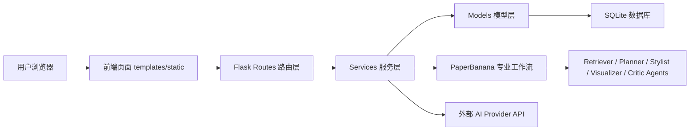
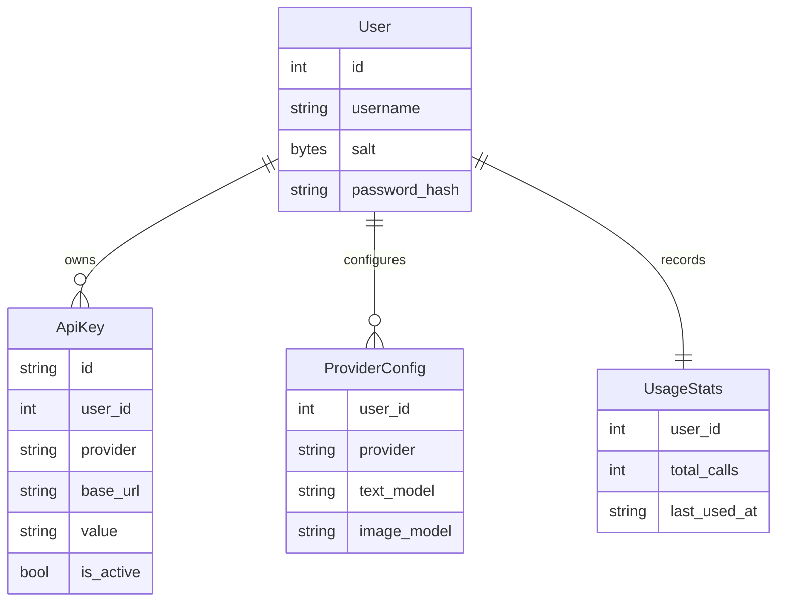
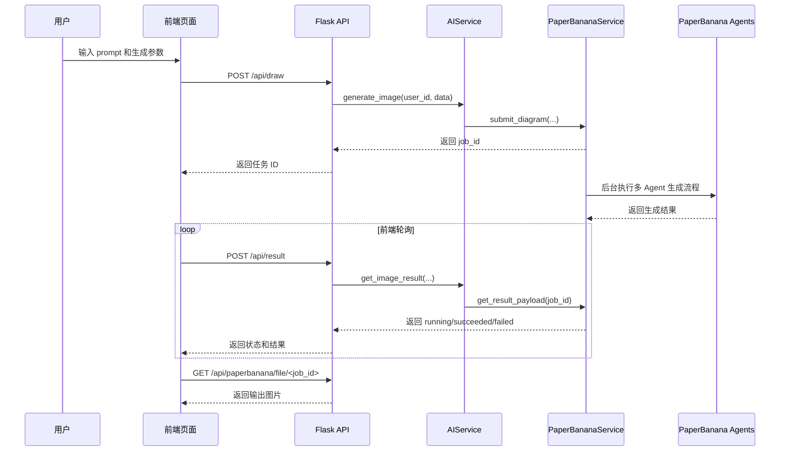

# 基于设计模式的 AI 科研绘图系统 MatchDrawer 的设计与实现

## 摘要

随着人工智能图像生成技术和多模态模型的发展，科研绘图从传统手工绘制逐渐向自然语言驱动的智能生成方式转变。为了提高科研图表、方法流程图和系统结构示意图的生成效率，本文设计并实现了一个面向科研绘图场景的 AI Web 系统 MatchDrawer。系统以设计模式思想为主要设计主线，围绕用户认证、API Key 管理、Provider 适配、图像生成任务管理、PaperBanana 专业绘图工作流和结果展示下载等功能展开。系统后端采用 Flask 框架，使用 SQLite 进行数据持久化，前端采用 HTML、CSS 和 JavaScript 实现交互界面，图像生成任务通过“任务提交、后台执行、状态轮询、结果返回”的方式完成。

本文重点分析 MatchDrawer 中设计模式的实际落地方式。系统通过工厂模式统一 Flask 应用创建过程，通过 MVC 模式划分模型层、路由层和视图层，通过单例模式与服务定位器模式复用配置、数据库和业务服务对象，通过装饰器模式和拦截过滤器模式统一登录校验与异常处理，通过外观模式封装 AI 生成和任务编排复杂度，通过适配器模式统一不同 Provider 与 PaperBanana 工作流的返回格式，通过模板模式和组合模式思想组织多 Agent 专业绘图流程。测试结果表明，MatchDrawer 能够完成 API Key 配置、模型参数选择、图像生成任务提交、任务状态轮询、异常提示和结果展示等主要功能，能够较好体现设计模式在真实项目中的解耦、复用、扩展和维护价值。

**关键词：** 设计模式；AI 科研绘图；Flask；任务轮询；适配器模式；外观模式；模板模式

## 1 引言

### 1.1 研究背景

在科研学习、论文写作、课程设计和项目展示中，图表是表达系统结构、方法流程、实验设计和结果分析的重要形式。传统科研绘图通常依赖人工使用 PowerPoint、Illustrator、Visio 或在线绘图工具完成，绘制效率较低，并且对绘图经验、版式设计能力和工具熟练度有一定要求。当图表需要反复修改时，人工绘制方式还会带来较高的维护成本。

近年来，AI 图像生成和多模态大模型发展迅速，用户可以通过自然语言描述生成图像内容。对于科研绘图场景而言，如果能够将“输入科研绘图需求、自动规划图表结构、调用图像生成模型、展示结果并支持下载”整合为一个 Web 系统，就可以显著降低科研图表生成门槛。基于这一背景，本文选择完成 MatchDrawer 作为综合实验项目。该项目不是单一算法示例，也不是简单页面展示，而是一个包含前端、后端、数据库、密钥管理、外部模型适配和后台任务流程的综合性 Web 系统。

综合实验的要求是自主选题、独立设计并实现一个程序项目，并在项目中体现设计模式理念。因此，本文不是单纯介绍 MatchDrawer 的功能，而是重点说明设计模式如何贯穿系统设计与代码实现过程。通过对系统模块划分、业务流程、关键代码和测试结果的分析，本文展示工厂模式、单例模式、装饰器模式、外观模式、适配器模式、模板模式、MVC 模式、服务定位器模式和传输对象模式等设计思想在真实项目中的应用价值。

### 1.2 研究意义

MatchDrawer 的设计与实现具有以下意义。

第一，系统具有实际应用价值。MatchDrawer 面向科研绘图场景，用户可以通过 prompt 描述科研图表需求，选择 Provider、模型和图像质量等参数，并通过 PaperBanana 专业工作流生成科研图表或方法示意图。这一流程贴近论文写作和科研展示中的真实需求。

第二，系统具有较强综合性。项目包含 Flask 后端、SQLite 数据库、用户认证、API Key 加密保存、Provider 模型配置、AI 图像生成、后台任务状态管理、前端轮询和结果文件下载等功能，能够覆盖综合实验对系统完整性和工作量的要求。

第三，系统适合体现设计模式。项目中存在大量需要抽象和解耦的场景：服务对象需要统一创建和复用，不同 Provider 的接口和返回格式需要适配，长时间运行任务需要统一状态传输，路由函数需要统一登录校验和异常处理，PaperBanana 多个 Agent 需要统一处理接口并组合成复杂工作流。这些问题都适合通过设计模式思想解决。

### 1.3 本文组织结构

本文结构如下：第 2 节介绍系统需求分析；第 3 节说明系统总体架构与数据设计；第 4 节重点分析系统中使用的设计模式；第 5 节说明关键代码实现；第 6 节给出系统测试与运行结果；第 7 节总结实验体会与后续优化方向。

## 2 系统需求分析

### 2.1 功能需求

MatchDrawer 的核心目标是提供一个可运行的 AI 科研绘图 Web 系统。系统主要功能需求如下。

1. **用户认证功能。** 系统需要支持默认用户初始化、登录、退出和登录状态维护，避免未授权用户访问核心功能。
2. **API Key 管理功能。** 用户可以为不同 AI Provider 添加 API Key、Base URL 和密钥名称。密钥需要加密保存，前端只能显示掩码。
3. **Provider 模型配置功能。** 系统需要支持为不同 Provider 保存默认文本模型和图像模型，便于后续生成任务自动读取配置。
4. **AI 图像生成入口。** 用户可以输入 prompt，选择 Provider、模型、图像质量等参数，并向后端提交生成任务。
5. **PaperBanana 专业工作流。** 系统需要支持多 Agent 工作流，包括检索、规划、风格优化、生图、审图和评估等阶段。
6. **任务状态轮询功能。** 图像生成属于耗时任务，系统需要返回任务 ID，并允许前端通过轮询方式查询任务状态。
7. **结果展示与下载功能。** 任务成功后，系统需要展示生成图片，并通过统一文件接口提供下载。
8. **异常处理功能。** 系统需要处理未登录、缺少 API Key、prompt 为空、任务 ID 无效、生成失败、用户取消任务等异常情况。

### 2.2 非功能需求

除功能需求外，系统还需要满足以下非功能要求。

1. **可维护性。** 系统模块之间应保持清晰边界，路由层、服务层、模型层和工具层职责明确。
2. **可扩展性。** 后续如果增加新的 Provider、新的模型或新的 Agent 工作流，应尽量减少对已有模块的影响。
3. **安全性。** API Key 等敏感信息不能明文展示，数据库中应保存加密后的密钥。
4. **健壮性。** 后台任务失败时应记录错误状态，前端应能看到可读错误信息，而不是长时间等待。
5. **易用性。** 前端界面应能展示任务阶段、进度和结果，让用户清楚理解系统当前状态。

### 2.3 设计模式需求

本次综合实验要求在项目中体现设计模式理念。本文对设计模式的理解不是“为了报告而罗列模式名称”，而是让设计模式解决真实工程问题。MatchDrawer 中的设计模式需求主要体现在以下方面。

| 工程问题 | 对应设计模式思想 | 解决方式 |
|---|---|---|
| 应用初始化逻辑容易分散 | 工厂模式 | 使用 `create_app()` 集中完成 Flask 应用创建、配置加载和蓝图注册 |
| 路由、业务和数据容易耦合 | MVC 模式 | 将模型层、路由层、模板和静态资源分离 |
| 服务对象重复创建 | 单例模式 / 服务定位器模式 | 使用 `get_xxx_service()` 懒加载并复用服务实例 |
| 登录校验和错误处理重复 | 装饰器模式 / 拦截过滤器模式 | 使用装饰器统一处理认证和异常 |
| AI 任务编排复杂 | 外观模式 | 使用 `AIService` 为路由层提供统一业务入口 |
| Provider 和工作流返回格式不同 | 适配器模式 | 后端统一转换为前端可消费的 JSON payload |
| 多 Agent 处理接口需要统一 | 模板模式 | 使用统一 `process()` 接口约束不同 Agent |
| 复杂绘图流程由多个步骤构成 | 组合模式思想 | 将 Retriever、Planner、Visualizer、Critic 等组合成工作流 |
| 后台任务状态字段较多 | 传输对象模式 | 使用 `PaperBananaJob` 封装任务状态数据 |

## 3 系统总体设计

### 3.1 系统架构设计

MatchDrawer 采用前后端协作的 Web 架构。用户通过浏览器访问前端页面，前端负责参数输入、任务提交、状态展示和结果渲染；后端通过 Flask 路由接收请求，再调用服务层完成业务逻辑；服务层根据需要访问数据库、调用 PaperBanana 专业工作流或外部 AI Provider；数据库用于保存用户、API Key、模型配置和使用统计等信息。

系统总体结构如图 1 所示。



**图 1 MatchDrawer 系统总体结构**

在该结构中，路由层不直接处理复杂业务，也不直接操作数据库；服务层负责业务编排；模型层负责数据表达与持久化；工具层负责加密、参数校验和异常类型等通用能力。这种分层设计对应 MVC 模式和外观模式思想，能够降低模块之间的耦合。

### 3.2 模块划分

MatchDrawer 的主要模块划分如表 1 所示。

**表 1 系统模块划分**

| 模块 | 主要文件或目录 | 职责 |
|---|---|---|
| 应用入口 | `app.py` | 创建 Flask 应用，加载配置，注册蓝图 |
| 路由层 | `src/routes` | 定义页面路由和 API 路由，完成请求解析和响应返回 |
| 服务层 | `src/services` | 封装认证、API Key、Provider 配置、AI 生成和任务管理 |
| 模型层 | `src/models` | 定义用户、API Key、Provider 配置和使用统计模型 |
| 工具层 | `src/utils` | 提供参数校验、错误类型、密钥加密等通用能力 |
| 前端页面 | `templates`、`static` | 提供页面结构、样式、事件绑定和任务轮询 |
| PaperBanana 集成 | `integrations/PaperBanana` | 提供科研图表生成多 Agent 工作流 |

从设计模式角度看，模块划分本身就是系统可维护性的基础。应用入口体现工厂模式，路由层体现前端控制器模式，服务层体现外观模式，模型层和数据库访问体现 DAO 思想，工具层则将加密、校验和异常处理等横切能力从业务代码中分离出来。

### 3.3 数据设计

系统主要数据对象包括用户信息、API 密钥、模型配置、使用统计和后台任务状态。数据关系如图 2 所示。



**图 2 系统核心数据关系**

API Key 是系统中最敏感的数据。系统通过 `EncryptionService` 对密钥加密保存，并通过掩码方式展示给前端。Provider 配置用于保存不同 Provider 的默认文本模型和图像模型，使生成流程可以根据用户配置自动补全参数。后台任务状态由 `PaperBananaJob` 表达，它不直接作为数据库表存在，而是在任务执行过程中保存为状态文件，用于前端轮询。

### 3.4 主要业务流程

图像生成是系统的核心业务。为了避免长时间同步请求导致浏览器阻塞，系统采用“提交任务 + 后台执行 + 前端轮询 + 结果下载”的异步任务流程，如图 3 所示。



**图 3 图像生成业务流程**

该流程体现了多个设计模式的协作：前端控制器收集用户参数；后端路由作为统一入口；`AIService` 作为外观封装任务创建；`PaperBananaService` 管理后台任务；`PaperBananaJob` 作为传输对象保存状态；结果查询接口将内部任务状态适配为前端统一 JSON。

## 4 设计模式应用分析

### 4.1 工厂模式

工厂模式用于封装对象创建过程，使调用方不需要了解对象的复杂初始化细节。在 MatchDrawer 中，`create_app()` 承担应用工厂角色。它负责创建 Flask 应用、加载配置、设置 session、注册认证蓝图、API 蓝图和主页面蓝图，并初始化默认用户。

```python
def create_app() -> Flask:
    config = get_config()
    app = Flask(__name__, template_folder="templates", static_folder="static")
    app.config["SECRET_KEY"] = config.app_secret_key
    app.register_blueprint(auth_bp)
    app.register_blueprint(api_bp, url_prefix="/api")
    app.register_blueprint(main_bp)
    _ensure_default_user()
    return app
```

该实现的意义在于：应用初始化逻辑集中在一个函数中，外部只需要调用 `create_app()` 即可获得完整应用对象，不需要关心配置、路由和默认用户如何创建。这符合工厂模式“隐藏创建细节、统一创建入口”的思想。

### 4.2 MVC 模式

MatchDrawer 采用 MVC 思想组织系统结构。其中，`src/models` 对应 Model，负责用户、API Key、Provider 配置等数据对象；`src/routes` 对应 Controller，负责接收 HTTP 请求、解析参数并调用服务层；`templates` 和 `static` 对应 View，负责页面展示和用户交互。

这种分层避免了路由函数直接写 SQL 或前端直接访问数据库的问题。以 `/api/draw` 为例，路由函数只负责获取当前用户和请求数据，然后调用 `AIService.generate_image()`。具体参数校验、模型选择和任务创建由服务层完成，路由层保持简洁。

### 4.3 单例模式与服务定位器模式

系统中许多服务对象需要被多个模块使用，例如配置对象、数据库管理器、认证服务、API Key 服务和 AI 服务。如果每次请求都重新创建这些对象，会造成重复初始化和状态不一致。MatchDrawer 使用模块级变量和 `get_xxx_service()` 函数实现懒加载单例。

```python
_ai_service: Optional[AIService] = None

def get_ai_service() -> AIService:
    global _ai_service
    if _ai_service is None:
        _ai_service = AIService()
    return _ai_service
```

该写法同时体现服务定位器模式。路由层只需要调用 `get_ai_service()`，不需要知道 `AIService` 如何构造、依赖哪些服务。这样可以降低调用方与具体实现之间的耦合。

### 4.4 装饰器模式与拦截过滤器模式

登录校验和异常处理是典型横切逻辑。如果每个路由函数都手写登录判断和 `try-except`，代码会重复且难以维护。MatchDrawer 在 `src/routes/decorators.py` 中定义 `api_login_required`、`login_required` 和 `handle_api_errors` 等装饰器。

```python
@api_bp.post("/draw")
@api_login_required
@handle_api_errors
def draw() -> Any:
    ...
```

装饰器模式的作用是在不修改原函数主体的情况下，为函数增加认证和异常处理能力。拦截过滤器模式的作用是让请求在进入业务逻辑前先经过统一检查，在业务异常发生后统一转换为 JSON 响应。这样路由函数可以专注业务分发，系统错误返回格式也更加统一。

### 4.5 外观模式

AI 图像生成涉及 Provider 选择、模型配置读取、prompt 校验、PaperBanana 工作流调用、任务状态记录和使用统计等多个子系统。如果路由层直接操作这些子系统，会导致控制器复杂度过高。MatchDrawer 使用 `AIService` 作为外观对象，对路由层暴露统一接口。

```text
Routes -> AIService -> ApiKeyService / ProviderConfigService / PaperBananaService / UsageStats
```

路由层只需要调用 `generate_image()`、`get_image_result()` 和 `cancel_image_result()` 等方法，不需要知道底层是使用 grsai、OpenAI-compatible Provider、Anthropic，还是 PaperBanana 本地工作流。外观模式降低了路由层复杂度，也使底层实现变化时不必频繁修改路由代码。

### 4.6 适配器模式

不同外部服务和内部工作流返回的数据结构不同。Anthropic、OpenAI-compatible Provider 和 PaperBanana 本地工作流在请求协议、状态字段和结果格式上都有差异。前端如果直接处理这些差异，会使展示逻辑变得复杂。MatchDrawer 在后端将不同来源结果统一转换为前端可消费的 JSON。

PaperBanana 成功结果示例如下：

```json
{
  "id": "job_id",
  "status": "succeeded",
  "progress": 100,
  "stage": "completed",
  "model": "paperbanana",
  "results": [
    {
      "url": "/api/paperbanana/file/job_id",
      "content": "PaperBanana generated"
    }
  ]
}
```

这就是适配器模式的作用：前端面对的是统一的 `status`、`progress`、`stageMessage` 和 `results` 字段，而不是每一种 Provider 的内部差异。

### 4.7 模板模式与组合模式思想

PaperBanana 专业工作流由多个 Agent 组成，例如 RetrieverAgent、PlannerAgent、StylistAgent、VisualizerAgent、CriticAgent 和 PolishAgent。这些 Agent 的具体职责不同，但都需要遵循统一的处理入口。系统通过抽象基类定义统一接口：

```python
class BaseAgent(ABC):
    @abstractmethod
    async def process(self, data: Dict[str, Any], **kwargs) -> Dict[str, Any]:
        pass
```

模板模式体现在父类约束统一处理接口，子类分别实现具体步骤。组合模式思想体现在复杂绘图流程不是由单个对象完成，而是由多个 Agent 按不同模式组合完成。例如完整流程可以包含检索、规划、风格化、生图、审图和评估多个阶段。这样每个 Agent 职责清晰，工作流也可以按需要扩展或裁剪。

### 4.8 传输对象模式

图像生成任务运行时间较长，前端需要持续了解任务状态。系统使用 `PaperBananaJob` dataclass 封装任务状态：

```python
@dataclass(frozen=True)
class PaperBananaJob:
    job_id: str
    status: str
    progress: int
    stage: str = "queued"
    stage_message: Optional[str] = None
    output_image_path: Optional[str] = None
    error: Optional[str] = None
```

该对象在后台任务执行、状态文件保存、结果读取和 API 返回之间传递数据。相比使用多个零散变量，传输对象能够保证字段结构统一，减少状态遗漏和格式不一致问题。

## 5 关键代码实现

### 5.1 前端参数收集与任务提交

前端核心入口位于 `static/js/app.js` 的 `generateImage(mode = 'generic')` 函数。该函数负责读取 prompt、Provider、模型、图像质量和工作流选项，并将这些参数整理成统一请求对象。

```javascript
const prompt = context.promptInput.value;
const textProvider = isPaperMode && DOM.generationTextProviderSelect
    ? DOM.generationTextProviderSelect.value
    : '';
const imageProvider = isPaperMode
    ? (DOM.paperImageProviderSelect ? DOM.paperImageProviderSelect.value : 'grsai')
    : (DOM.generationImageProviderSelect ? DOM.generationImageProviderSelect.value : 'grsai');
```

这段代码体现前端控制器思想。页面控件可以不同，但提交给后端时会整理成统一参数结构。前端随后调用 `window.APIService.generateImage()`，并通过 `onProgress` 更新任务阶段，通过 `onComplete` 渲染最终结果。

### 5.2 APIService 的统一请求封装

`static/js/api-service.js` 中的 `APIService` 是前端访问后端的统一外观。提交任务时，`generateImageStream()` 组装请求体并调用 `/api/draw`；得到任务 ID 后，`generateImage()` 每 5 秒调用 `/api/result` 轮询状态。

```javascript
const response = await this.makeRequest('/api/draw', 'POST', body);
const taskId = submitResult.taskId;
const pollResult = await this.getImageResult(taskId);
```

这种“提交任务 ID + 轮询状态”的实现避免了长时间同步等待。对于耗时 AI 生成任务，这种结构能够提升用户体验，也便于展示任务阶段和失败原因。

### 5.3 后端路由控制器实现

后端接口集中在 `src/routes/api_routes.py`。以图像生成接口为例：

```python
@api_bp.post("/draw")
@api_login_required
@handle_api_errors
def draw() -> Any:
    auth_service = get_auth_service()
    ai_service = get_ai_service()
    user_id = auth_service.get_current_user_id()
    data = request.get_json(force=True, silent=True) or {}
    result = ai_service.generate_image(user_id, data)
    return jsonify(result)
```

路由层没有直接操作数据库，也没有直接调用外部模型，而是通过服务定位器获取服务对象，再调用 `AIService`。这体现 MVC 和前端控制器模式，也说明路由层职责被控制在请求分发范围内。

### 5.4 AIService 的业务外观实现

`AIService.generate_image()` 是后端图像生成的统一入口。它负责解析 Provider、读取模型配置、校验 prompt、补全默认模型，并调用 `PaperBananaService.submit_diagram()` 创建后台任务。

```python
text_provider = self.api_key_service.normalize_provider(text_provider)
image_provider = self.api_key_service.normalize_provider(image_provider)
service = get_paper_banana_service()
job_id = service.submit_diagram(...)
return {"code": 0, "data": {"id": job_id}}
```

该实现体现外观模式。对于路由层而言，图像生成只是一个服务方法调用；对于服务内部而言，它实际整合了 Provider 配置、参数校验、任务创建和使用统计等多个子系统。

### 5.5 后台任务状态管理

`PaperBananaService.submit_diagram()` 创建任务 ID，写入初始状态，并启动后台线程：

```python
job_id = uuid.uuid4().hex
self._write_status(
    PaperBananaJob(
        job_id=job_id,
        status="running",
        progress=1,
        stage="queued",
    )
)
thread = threading.Thread(target=self._run_job_safe, args=(...), daemon=True)
thread.start()
return job_id
```

后台线程由 `_run_job_safe()` 包裹。如果任务失败，系统会捕获异常并写入 failed 状态。任务成功后，系统会将 base64 图片解码为 `output.jpg`，并把状态更新为 `succeeded`。这一流程使前端能够通过统一状态接口观察任务生命周期。

### 5.6 API Key 加密与掩码展示

API Key 管理由 `ApiKeyService` 和 `EncryptionService` 完成。用户添加 Key 时，系统先清洗输入，再加密保存：

```python
value = self._sanitize_api_key_value(value)
value=self.encryption.encrypt(item.get("value", ""))
```

前端展示密钥列表时，后端使用掩码函数：

```python
def mask_key(value: str) -> str:
    if len(value) <= 8:
        return f"***{value[-2:]}"
    return f"{value[:4]}...{value[-4:]}"
```

因此系统既能支持多 Provider 密钥管理，又能避免在页面和数据库中直接暴露明文密钥。

## 6 测试与结果分析

### 6.1 测试方法

本次测试采用手工功能测试和接口流程验证相结合的方式。测试前启动 Flask 后端服务，然后通过浏览器访问 MatchDrawer 页面，依次检查登录、API Key 配置、模型配置、图像生成、任务轮询、结果展示和异常提示。

除功能正确性外，测试还关注设计模式是否真正发挥作用：API Key 切换用于验证 Provider 选择和服务定位是否有效；任务状态轮询用于验证传输对象和适配器返回结构是否稳定；异常提示用于验证装饰器和拦截过滤器是否统一处理错误；PaperBanana 工作流用于验证模板模式和组合模式思想是否能够组织多 Agent 流程。

### 6.2 功能测试结果

**表 2 功能测试结果**

| 测试项 | 测试方法 | 预期结果 | 实际结果 |
|---|---|---|---|
| 应用启动 | 启动 Flask 应用并访问首页 | 服务正常启动，首页可访问 | 正常 |
| 默认用户初始化 | 首次访问系统 | 自动创建默认用户 | 正常 |
| 登录功能 | 输入用户名和密码登录 | 登录成功后进入主页面 | 正常 |
| API Key 添加 | 添加 Provider Key | 数据库存储密钥，前端显示掩码 | 正常 |
| API Key 激活 | 切换 active key | 同 Provider 只保留一个 active key | 正常 |
| 模型配置 | 修改 Provider 默认模型 | 保存后生成流程可读取配置 | 正常 |
| 图像任务提交 | 输入 prompt 并点击生成 | 返回任务 ID | 正常 |
| 任务状态轮询 | 前端定时请求 `/api/result` | 返回 running、succeeded 或 failed 状态 | 正常 |
| 结果文件下载 | 访问 `/api/paperbanana/file/<job_id>` | 返回生成图片 | 正常 |
| 异常处理 | 缺少 Key 或 prompt 为空 | 返回明确错误信息 | 正常 |

从设计模式验证角度看，API Key 添加和激活证明 `ApiKeyService` 与服务定位器能够统一管理 Provider 凭据；模型配置证明后端外观服务能够读取并组合多个子服务；任务提交和轮询证明传输对象和适配器 payload 能够稳定传递；异常处理证明装饰器和拦截过滤器能够把不同异常转换为统一响应。

### 6.3 运行截图

系统启动后可以正常进入主页面，页面提供图像生成、API 密钥管理、模型配置和专业工作流等入口，如图 4 所示。


API 密钥管理页面支持 Provider、Base URL、API Key 和密钥名称配置。密钥保存后通过掩码方式展示，如图 5 所示。


图像生成页面支持 prompt 输入、Provider 选择、图像模型选择和图像质量设置，如图 6 所示。


任务提交后，系统返回任务 ID，前端通过轮询 `/api/result` 查询任务状态，并显示当前阶段和工作流节点，如图 7 所示。


任务成功后，前端能够展示生成图片，并通过 `/api/paperbanana/file/<job_id>` 下载输出结果。测试生成结果如图 8 所示。


### 6.4 异常测试分析

系统对常见异常场景进行了处理。prompt 为空时，`ValidationService` 会抛出校验错误，避免无效任务进入后台；未配置 API Key 时，`ApiKeyService` 会返回缺少密钥提示；任务 ID 为空时，`validate_draw_id()` 会进行拦截；后台任务失败时，系统会写入 `failed` 状态和错误信息；用户取消任务时，系统会写入 `cancelled.flag`；上游服务异常时，装饰器会将异常转换为统一 API 错误响应。

这些异常处理说明系统不仅关注成功流程，也关注失败流程的可观察性。尤其是后台任务失败时，前端不需要猜测任务是否仍在运行，而是可以根据统一状态字段展示失败原因。

## 7 结论与体会

本文设计并实现了一个基于设计模式的 AI 科研绘图 Web 系统 MatchDrawer。系统完成了用户认证、API Key 管理、Provider 模型配置、图像生成任务提交、PaperBanana 专业工作流、任务状态轮询、结果展示下载和异常处理等功能，满足综合实验对自主选题、功能完整性、运行结果和设计思想分析的要求。

通过本项目可以看出，设计模式的价值不在于“用了多少个模式”，而在于是否真正解决了系统复杂性。MatchDrawer 中的设计模式主要解决了四类问题：第一是模块解耦，例如路由层通过外观服务访问复杂业务；第二是流程组织，例如 PaperBanana 多 Agent 通过统一接口串联；第三是接口适配，例如不同 Provider 和本地工作流都转换成统一结果结构；第四是复用和安全，例如服务单例、登录装饰器和密钥加密封装减少了重复代码。

本次实验也暴露出一些后续可优化方向。当前后台任务使用本地线程和文件状态保存，适合单机运行，但不适合高并发或多实例部署；Provider 选择目前主要通过条件分支实现，后续可以进一步抽象为标准策略模式；前端主页面使用较多原生 JavaScript，全局状态较多，后续可以进一步组件化；PaperBanana 工作流运行时间较长，后续可以加入任务队列、进度推送和缓存机制。

总体而言，MatchDrawer 完成了从自主选题、系统设计、功能实现、设计模式落地到测试分析的完整过程。通过本次综合实验，我不仅完成了一个可运行的 AI 科研绘图 Web 系统，也更加理解了设计模式在真实项目中的作用。设计模式不是抽象概念的堆砌，而是在真实工程中帮助系统降低耦合、提升复用、隔离变化和增强可维护性的有效方法。

## 参考文献

[1] Gamma E., Helm R., Johnson R., Vlissides J. *Design Patterns: Elements of Reusable Object-Oriented Software*. Addison-Wesley, 1994.

[2] Fowler M. *Patterns of Enterprise Application Architecture*. Addison-Wesley, 2002.

[3] Flask Documentation. Application Factories and Blueprints.

[4] Python Documentation. `dataclasses`, `threading` and `sqlite3` modules.

[5] MatchDrawer 项目源码与本地运行测试结果。
